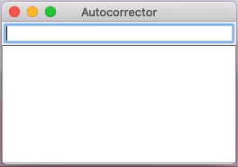

# Project 5: Autocomplete
[Download Starter Code](proj5-starter.zip)



*Autocomplete* is pervasive in modern applications. As the user types, the program predicts the complete *query* (typically a word or phrase) that the user intends to type. Autocomplete is most effective when there are a limited number of likely queries. For example, the Internet Movie Database uses it to display the names of movies as the user types; search engines use it to display suggestions as the user enters web search queries; cell phones use it to speed up text input.

In these examples, the application predicts how likely it is that the user is typing each query and presents to the user a list of the top-matching queries, in descending order of likelihood. These likelihoods are determined by historical data, such as box office revenue for movies, frequencies of search queries from other Google users, or the typing history of a cell phone user. For the purposes of this assignment, you will have access to a corpus of English text from which you will deduce how likely it is for certain words to be autocompleted in various ways.

The performance of autocomplete functionality is critical in many systems. For example, consider a search engine (such as Google) which runs an autocomplete application on a server farm. According to one study, the application has only about *50 milliseconds* to return a list of suggestions for it to be useful to the user. Moreover, in principle, it must perform this computation *for every keystroke typed into the search bar* and *for every user*!

In this assignment, you will implement autocomplete in four parts.

## Part A: Mergesort

In this part, you will implement the mergesort algorithm and write some tests to make sure it is correct.  For this part, you will work on the files `Mergesort.java` and `MergesortTester.java`. 

The code you will write will be based on the mergesort code from class, so you should base your code off of that.  The only difference is that your code will use ArrayLists rather than plain arrays, and we will use a Comparator to let us sort things in different ways.

### What is a Comparator?

A Comparator is a Java class that implements the [Comparator](https://docs.oracle.com/en/java/javase/13/docs/api/java.base/java/util/Comparator.html) interface.  The Comparator interface has only  one method that must be implemented, which is `compare`.  The `compare` function in a Comparator is almost exactly like the `compareTo` function in a [Comparable](https://docs.oracle.com/en/java/javase/13/docs/api/java.base/java/lang/Comparable.html) object.  Here's the difference:

- The `Comparable` interface is implemented on the objects themselves that will eventually be compared (or sorted).  For instance, Integers and Strings are comparable.  Every class that implements `Comparable` has a `compareTo` method that takes a single argument of that class, and calling `a.compareTo(b)` compares objects `a` and `b`.
- The `Comparator` interface is implemented on a **separate** class from the objects being sorted.  Typically it is used to introduce some sort of alternate ordering method on objects that are already comparable, or to introduce an ordering on objects that do not have one built-in through `Comparable`. Every class that implements `Comparator` has a `compare` method that takes two arguments of the class that will be compared, and calling `compareTo(a, b)` compares objects `a` and `b`.

- Both functions (`compareTo` and `compare`) must return a negative number (often -1) if the first object (`a`) is "less than" the second (`b`), a positive number (often +1) if the first object is "greater than" the second, and zero if they are "equal," where "equal" in this case means any two objects where the order shouldn't matter.  


### Writing Part A

- In `Mergesort.java`, fill in the `merge()` function.  It mirrors the `merge()` function from the mergesort handout discussed in class.  The only differences are that it uses ArrayLists instead of plain arrays, and it uses a `Comparator` object passed in as an argument, so every time the code from class compares items from the array with `<`, `>`, or `==`, you should use the `compare` function on the comparator instead:

- ```
  REGULAR WAY         WITH COMPARATOR
  ------------------------------------
  if (a < b)          if (compareTo(a, b) < 0)
  if (a > b)          if (compareTo(a, b) > 0)
  if (a <= b)         if (compareTo(a, b) <= 0)
  if (a >= b)         if (compareTo(a, b) >= 0)
  if (a == b)         if (compareTo(a, b) == 0)
  ```

- When you think you're done with `merge()`, try running `MergesortTester`.  You should be able to sort numbers and individual letters forwards and backwards now.  You will also notice the last case uses a Comparator at the end of the file called `CompareStringsIgnoreCase`.  Take note of this comparator, as you will be writing your own later.

[Compare against sample output](mergesort-output.txt).

## Part B: HashtableMap

In this part, you will implement a Map based on a hash table (in the last project, you implemented a Map based on a BST).  For this part, you will work on the files `HashtableMap.java` and `HashtableMapTester.java`. 

### Getting acquainted with HashtableMap

- A HashtableMap implements a map based on a hashtable.  The hash table uses *chaining*.  The table is based on this variable: `ArrayList<LinkedList<KVPair<K, V>>> table`.
  - This is an ArrayList that contains linked lists.  Each linked list contains a sequence of KVPairs (key-value pairs).  The KVPair class is defined at the end of the file.
  - This looks like a complicated definition, but if you read it from left to right, you should be able to parse out the meaning.  KVPairs (of keys and values) inside of a LinkedList, inside of an ArrayList.
- Java objects always have a `hashCode` function built in.  Often when declaring your own objects, you override this function.  What this means is that you don't have to worry about writing hash code functions inside this class.
- Take a look at the constructor for the class.  Notice how it takes an `initialSize` parameter.  This allows the user to set the size of the hashtable.  This is very unusual in practice --- normally the hash table size is controlled by the programmer.  However, to allow us to play with the size of the table, we will allow it to be controlled by this parameter.

### Writing Part B

I suggest the following steps to write this class.

- Write the `put()` function, which accepts a new key-value pair and adds it to the hash table. Notice that the specific hash index is already computed for you.  Follow the instructions in the code.
- Write the `get()` function, which searches the hash table for a specific key and returns the corresponding value.
- At this point you can test get/put using `HashtableMapTester.java`.  The only part you'll need to write extra test code for is for when `put` has to overwrite a value with a new value (when you `put` the same key twice with different values).
- Write `containsKey()`.  This is almost identical to `get`; in fact you can write this in terms of get if you want.  Test in `HashtableMapTester`.
- Write `size()`.  Follow the instructions in the code.  Test in `HashtableMapTester`.
- Write `keySet()`.  Follow the instructions in the code.  Test in `HashtableMapTester`.
- Write `printTable()`.  This is the hardest function to get right, though it's not particularly complicated in how it works.  Follow the instructions in the code.  Test in `HashtableMapTester`.

At this point your HashtableMapTester output should match mine.  [Compare it](maptester-output.txt).

## Part C: Reading the file

Next, you will write code in `AutocorrectDemo.java` to open a file with a large amount of text and tally up how often each word occurs.  You have two sample files: `small.txt`, which is a small demo file, and `nyt.txt`, which is a large amount of text taken from *New York Times* articles.

- Fill in the code in `processFile()` to read in the text and keep a count of each word frequency.  The way this code works is almost identical to how you processed the text in the movie reviews program (except there are no scores).  Loop over the words in each line, and keep track of the number of times you see each word in `wordFreqs`.
- When done, you should be able to run `main()` in AutocorrectDemo.  Compare your output on `small.txt` and `nyt.txt` against mine. It should match up to the `printTable` step.  Note that in order to match, you should use a table size of 5 with `small.txt` and a table size of 23456 with `nyt.txt`. 

## Part D: Writing the autocorrector

In the last step, you will write the code for the autocorrector.  When you are typing on your phone, your phone tries to predict what you're typing in two different ways.

- First, it tries to **autocomplete** what you've typed, in that it assumes what you've typed is the beginning of a longer word, and it tries to predict the remaining letters in the word.
- Second, it tries to **autocorrect** what you've typed, in that it tries to figure out if you made a spelling mistake while typing, and it tries to predict what you actually meant.

In part D, you will write code for both of these tasks.

----

Sample output for [small.txt](small-output.txt), [nyt.txt](nyt-output.txt).

- Begin in `getBestAutocomplete` in Autocorrector.java.  Write this function, which is designed to take a string and look for the most common word in the wordFreq map that has the string as a prefix (this is the "autocomplete" part of the autocorrector: it's going to predict what word you've typed the first few letters of).

  - To write this function, loop over all the words in the `wordFreq` map using keySet().  For each word, see if inputString is a prefix of that word.  If so, then get the word's frequency, and find the largest frequency.  (This sounds complicated, but it's just the standard maximum algorithm you learned in 141.)
  - If there are **no** strings in the `wordFreq` map with the inputString as a prefix, you should return `null`.
- Once you've written `getBestAutocomplete`, you can start running the test code in `testAutocorrect()`. At this point, only the "Autocomplete" lines will work, but you can test your output against mine, for both `small.txt` and `nyt.txt`.
- The autocorrect code is already written for you.  This code (in `editDistance1` and `getBestAutocorrect`) takes a string that the user has typed in and looks for all strings in your `wordFreq` map that have only one letter difference, where a difference can be a letter substitution, transposition, or adding or removing one letter.  So for instance, if you typed in `ct`, it would find words like `cat`, `cot`, `at`, etc.
- Now you can write `getBestSuggestions()`. You will write this function in two phases.  For now, what you should inside this function is:

  - Call `getBestAutocomplete` and `getBestAutocorrect` and store the results in variables.
  - Make a new ArrayList of strings to hold the final result.
  - Add all the strings that came back from `getBestAutocorrect` (this is a set) to the ArrayList.
  - If the autocomplete string is not null (it might be null), then add it to the ArrayList as well.
  - return the ArrayList as the return value of the function.
- You're almost done! At this point you can run the tester code on both small.txt and nyt.txt, and the *only* difference should be the order of the words that come out of `getBestSuggestions`.  If you want to have some fun, try testing out the graphical user interface by uncommenting the two lines at the end of `main()`. 
- Last step: We need to **sort** the autocomplete/autocorrect suggestions by word frequency.  To do this, we will write a `Comparator<String>` (I promisd we'd come back to those!).  Head back to `Autocorrecter.java`.  At the very end is a `Comparator` for Strings.  You must fill in the `compare` function to do a two-level comparison between the Strings s1 and s2, which will be words from your `wordFreq` map.  The basic idea is to compare s1 and s2 by their corresponding values in the map (which are, of course, how often each word appeared in the original text file.)  s1 should come "before" s2 if s1 is a more popular word (has a higher frequency) than s2.
  - Here's how to do it:
  - Get the frequency of each word (s1 and s2).
  - If the frequencies are different, return either -1 or +1 depending on which frequency is higher (think about which goes with which).
  - If the frequencies are the same, then we will compare the strings based on alphabetical order, whicih you can do by calling `s1.compareTo(s2)` and returning the result.

** Added Tue, April 12: **

I forgot to explain what to do after you write the Comparator. After you write the Comparator, you must call your mergesort function from earlier.
Inside getBestSuggestions(), after you’ve added all the strings to a new ArrayList, you should do the following:
WordByFrequencyComparator comp = new WordByFrequencyComparator();
Mergesort.mergesort([name of your list variable], comp);
Then return the list of strings, and you’re done! Your output should match mine now.

## Part E: Celebrate

At this point, you are done!  You should confirm that your output matches mine exactly on small.txt and nyt.txt.  The only parts that might be different are the results printed from "Autocorrect", but the results from "Autocomplete" and "Best suggestions" should match exactly.

Feel free to play around with the GUI.

## Submitting your code

**Please, please, please** before submitting, make sure that in `AutocorrectDemo.java`, the call to `testAutoCorrect` is uncommented (because I will run this function to test your code).  It would also be helpful if you commented out the two calls to the window code that opens the GUI (since I will not use that to test your code).

Upload *all* the Java files to Canvas; there are 7 in total. 

## Hints and tips

- The `get()` & `put()` functions in the hash table should **not** iterate over the entire table. The whole point of a hash table is you get constant time access to the correct slot in the table, calculated from the hash function. So the first thing you should do inside get & put is determine the correct index in the table to examine (and you'll never need to look at any other index, because we're using chaining).  Note that `put` already has this written for you; you can use the same idea in `get`. 
  - Note that `get` and `put` **are** allowed to iterate over the linked list at the appropriate index.
- On the other hand, `printTable` and `keySet` will need to iterate over the entire hash table.
